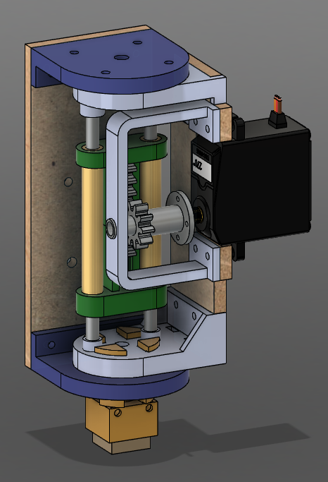

  

# CS-358 Project : MKLEGO 

 
 

## Project overview

MKLEGO is a 3D printer that uses LEGO bricks to build any given structure layer by layer. The project is based on mofifying a PRUSA MK3 3D printer by 
- replacing the extruder with a custom nozzle that can pick, place and rotate LEGO bricks,
- changing the base plate to a LEGO compatible plate with place for custom LEGO brick dispensers,
- developing custom software to convert 3D models into LEGO brick instructions.

## Software
### How to run
Access the software repository here: [MKLEGO Software](/frontend/).
Run it by :
- From the `frontend` folder, run the project with 
   
   `./gradlew :desktop-app:run`.
- The application window should open. You can see your recent projects and open them if there are any.

Creating a new project :
- To create a new project, click on File > New File, then select an STL or lxfml file to load and slice a 3D model, or nothing to create a blank project.
- You can go back to the recent projects by clicking on File > Recent Projects.

Editing :
- Once you have opened a project, you can add, remove, or paint LEGO bricks.
- You can see the controls by pressing `H`.
- To paint an existing brick: select the targeted brick, then click on a color in the palette.

Supports :
- The translucid bricks are support bricks. They are added automatically underneath hanging bricks. You can also add some manually by using the gray color (rightmost) in the color palette. You can hide/show them by clicking on "Hide Supports" in the top right.

Printing :
- To export your LEGO project: open the desired project and go to File > Export as lgcode.
- To print your LEGO structure, export it as lgcode, store it in a SD card and transfer the file to the printer. Then, you can set the printer and launch the build through the printer's screen interface.
- You will be asked to show on the screen where your dispensers are placed and then the real printing will commence!

Screen Interface:
- Home Screen: you can select to either go to print or to settings
- Settings: Silent mode: If you do not want to hear the screen beep, Calibrate: Calibrate the x, y, z axis and the rotation (please do it before printing anything), Back: Get back to main menu (Home)
- Print menu: Press Files to chose a file to execute and Back to get back to Home. If on files chose which file to execute.
- File execution: If .TXT file the screen will play a music corresponding to the file. If .LG or .LGCODE file the model will be printed

### Pipeline
The JavaFX-based software pipeline includes:
- Loading a 3D model from an STL or lxfml (v5.0 Legacy LDD compatible) file,
- Slicing it into LEGO brick layers and assembling them in an optimal agencement,
- Rendering the LEGO structure in a 3D viewer to view and edit the build if needed,
- Generating the lgcode (custom g-code) instructions to be sent to the printer.

## Hardware architecture
 
 

 
 

 
 

### Firmware
Access the firmware repository here: [MKLEGO Firmware](/embedded/mklego).

### System Overview

The hardware is organized around a **dual-microcontroller architecture**:

- **Main Controller**: STM32 Nucleo-64 (NUCLEO-F411RE)  
  Responsible for motion control (stepper motors), safety-critical timing, and real-time coordination.

- **Baseplate Controller**: ESP32-S3-DevKitC  
  Responsible for high-level logic, sensor acquisition, dispenser module control, and communication with the main controller.

The system integrates:
- Up to **8 LEGO dispenser modules**
- **3-axis stepper motor control (X, Y, Z)**
- A **servo motor** that pushes the brick down through the nozzle
- A centralized **power supply unit (PSU)** providing 5 V and 12 V rails

# Building Tutorial

This section explains how to physically build the MKLEGO prototype from a Prusa MK3 printer and the provided custom parts.  
All mechanical parts (DXF, STL and 3MF files) are available in the repository.

---

## Step 1: Preparation

### Required base machine
This prototype **requires a Prusa MK3 printer** as the mechanical base (frame, linear rails, motors).

### Disassembly
Before starting the build:

1. Power off and unplug the printer.
2. Remove the following components from the Prusa MK3:
   - Heated bed
   - Original extruder and hotend
   - Power Supply Unit (PSU)

⚠️ These components are **not used** in the MKLEGO system.

At the end of this step, you should keep:
- The printer frame
- X/Y/Z motion system
- Stepper motors

---

## Step 2: Mechanical Assembly Overview

The MKLEGO hardware is composed of three main subsystems:

1. **Custom LEGO Nozzle**
2. **LEGO-Compatible Base Plate**
3. **LEGO Brick Dispensers**

Each subsystem can be assembled independently before final integration on the printer.

---

## Nozzle Assembly

  

 

### Notes
Primarily use M3 screws. M2.5 depending on the 3d files

---

### Materials

- [ ] 1 × NEMA 14 stepper motor  
- [ ] 1 × Servo motor (15 kg·cm recommended)  
- [ ] 2 × Brass hollow cylinders  
  - Outer diameter: 8 mm  
  - Inner diameter: 5 mm  
  - Length: 64 mm  
- [ ] 2 × Metal rods (97 mm long)  
- [ ] 3 × Springs (10 mm length)  
- [ ] 1 × Micro-switch  
- [ ] M3 and M2.5 screws and nuts  
- [ ] MDF parts (laser cut)  
- [ ] PETG parts (3D printed)

---

### Assembly Process

1. **Prepare the parts**
   - Laser cut all MDF components using the provided DXF files.
   - 3D print all plastic parts (PETG).

2. **Linear structure**
   - Assemble all sliding components along the two metal rods.
   - Ensure smooth motion without excessive friction.

3. **Rotation mechanism**
   - Mount the servo motor.
   - Assemble the rotating LEGO-gripping section.

4. **Final enclosure**
   - Add the fixed (non-rotating) outer structure.
   - Install the micro-switch for rotation calibration.

A fully assembled 3D model of the nozzle is available as a **3MF file** for reference.

### Notes:
Use M3 conical screws to connect the baseplate to the printer

---

## Base Plate Assembly

  

---

### Materials

- [ ] 1 × Micro-switch  
- [ ] MDF parts (laser cut)  
- [ ] PETG parts (3D printed)  
- [ ] 1 × LEGO base plate (22 × 22 studs)

---

### Assembly Process

1. Fabricate all MDF and PETG parts using the provided DXF and STL files.
2. Assemble the mechanical structure of the base plate.
3. Install the micro-switch for Y-height referencing.
4. **You do not need mount the LEGO plate yet**

### Notes:
Use M3 conical screws to connect the dispensers as there needs to not be anything between them
do not add any screws to the middle screw holes of the dispensers
The path to lay the wires on the left side of the dispenser needs to be filed down to fit two wires 

A complete assembled model is also available as a **3MF file**.   

---

## Dispenser Assembly

  

---

### Materials (per dispenser)

- [ ] 1 × IR LED  
- [ ] 1 × IR Receiver  
- [ ] M3 screws and nuts  
- [ ] MDF parts (laser cut)  
- [ ] PETG parts (3D printed)

---

### Assembly Process

1. Assemble the mechanical ramp structure.
2. Install the IR LED and IR receiver:
   - Align them carefully to ensure reliable brick detection.
3. Test brick feeding manually before electronic integration.

A complete dispenser assembly is provided as a **3MF file**.

---
## Micro switches

 

--- 

### Materials

- [] M2.5 screws and bolts
- [] 2 micro switches
- [] wires
- [] PETG parts (3D printed)

### Assembly Process
print the 3D structure
connect the wires into the main electrical box

---

 

### Main Electrical

---
### Materials
- [] 1 Arduino Mega
- [] 1 CNC shield with 4 motor drivers
- [] 1 motor driver
- [] 2 buck converters

### Setup instructions:
Arduino mega connects to the four motor drivers on the CNC shield
The four mk3 mothors are connected to the CNC shield
The motor driver is driving the Nema 14
Micro switches are connected to the Arduino Mega
Arduino controlls the servo motor (PWM pin)
Buck converter at 7V powers the Servo motor 
Buck converter at 8V powers the Nema 14
Barrel jack for the power supply at 12V powering the CNC shield and the buck converters
Arduino mega commmunicates with the ESP32(second electrical box) via a custom protocol found in the arduino code on the github
find the dxf files at resources/3D Models/Boxes/MDF_main_electrical_box.dxf

---

 

### Secondary Electrical

---
### Materials
- [] 1 ESP32 S3 Dev Module
- [] 1 MOSFET 

### Setup instructions:
find the dxf files at resources/3D Models/Boxes/MDF_sub_electrical_box.dxf

### Notes:
This electrcial box connects to the dispensers
Connected by velcro to the printer body
The esp32 is connected to the dispensers and reads an adc input inside of a Voltage divider. Depending on the adc input we can deduce if a dispenser is connected, and which one it is, based on its internal resistance.
